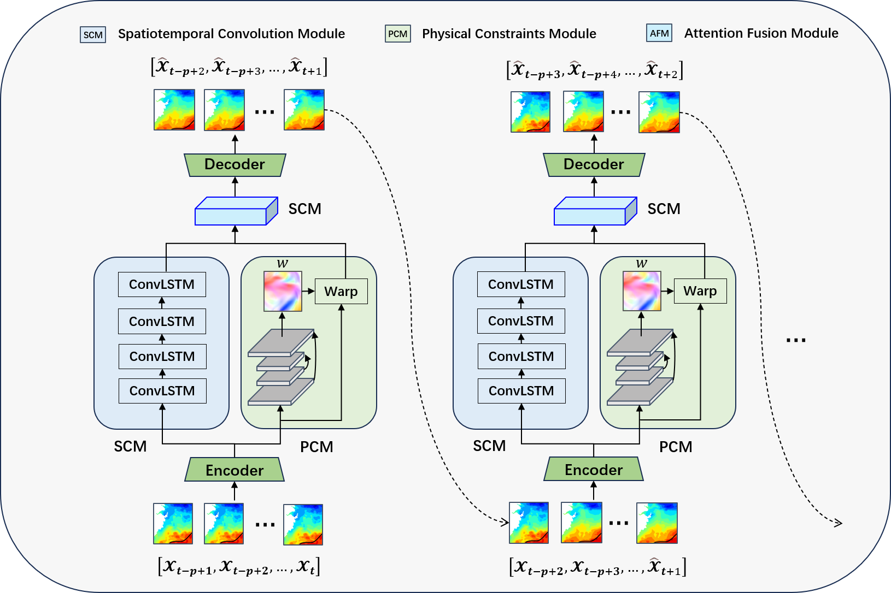

# PANN - A Physics-guided Attention-based Neural Network for Sea Surface Temperature Prediction

Code for PANN

## Abstract
Accurate prediction of sea surface temperature (SST) is crucial in the field of oceanography, as it has a significant impact on various physical, 
chemical and biological processes in the marine environment. In this study, we propose a physics-guided attention-based neural network (PANN) to address the spatiotemporal SST prediction problem. 
The PANN model incorporates data-driven spatiotemporal convolution operations and the underlying physical dynamics of SSTs using a cross-attention mechanism. 
First, we construct a spatiotemporal convolution module (SCM) using ConvLSTM to capture the spatial and temporal correlations present in the time series of the SST data.
We then introduce a physical constraints module (PCM) to mimic the transport dynamics in fluids based on data assimilation techniques used to solve partial differential equations (PDEs). 
Consequently, we employ an attention fusion module (AFM) to effectively combine the data-driven and PDE-constrained predictions obtained from the SCM and PCM, aiming at enhancing the accuracy of the predictions. 
To evaluate the performance of the proposed model, we conduct short-term SST forecasts in the East China Sea (ECS) with forecast lead times ranging from 1 to 10 days, by comparing it with several state-of-the-art models, including ConvLSTM, PredRNN, TCTN, ConvGRU, and SwinLSTM. 
The experimental results demonstrate that our proposed model outperforms these models in terms of multiple evaluation metrics for short-term predictions.